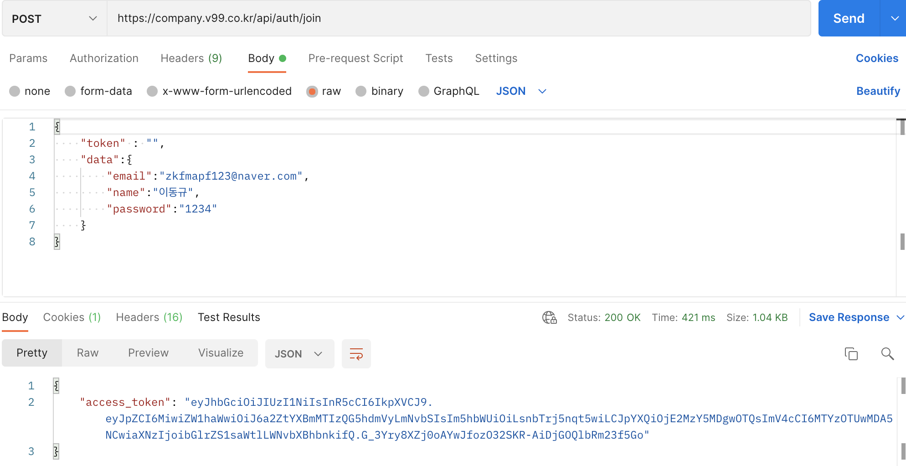
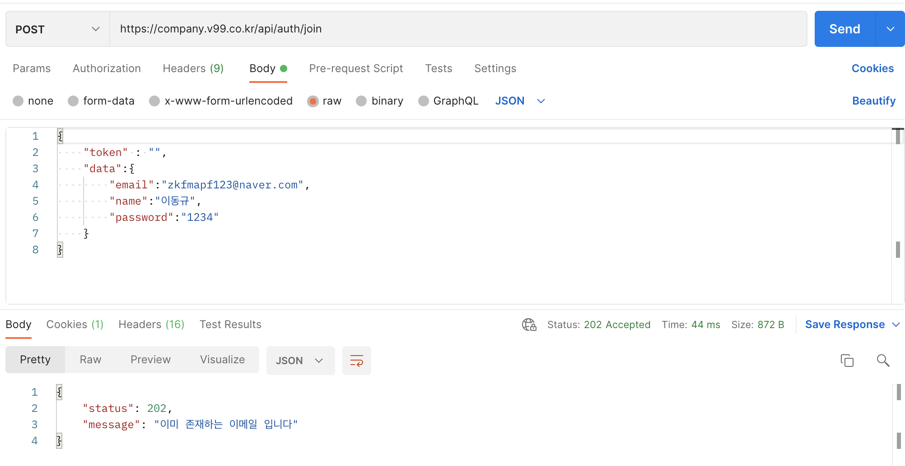
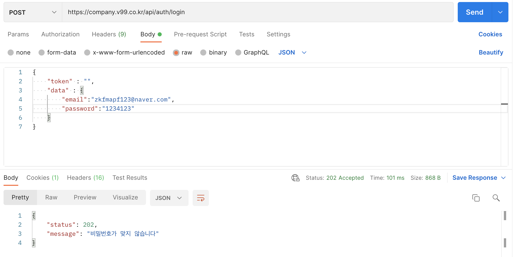
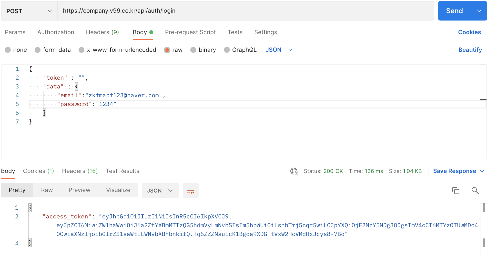

# 좋좋소 api documents

url : https://company.v99.co.kr

## REST API
- 인증
    - [x] 로그인
    - [x] 회원가입

### 인증

#### 로그인

- method : POST
- url : https://company.v99.co.kr/api/auth/login

```
    // request
    {
        headers : {
            Content-Type : application/json; charset=utf-8
        },
        body:{
            data : {
                "email" : "",
                "name" : "",
                "password": ""
            }
        }
    }
```

```
    // response

    200 OK
    202 Accept ( 이메일 중복 )
    202 Accept ( 닉네임 중복 )
    500 Server Error ( 서버 에러 )
```





#### 회원가입

- method : POST
- url : https://company.v99.co.kr/api/auth/join

```
    // request
    {
        headers: {
            Content-Type : applictaion/json; charset=utf-8
        },
        body:{
            data:{
                "email" : " ",
                "password" : " ",
            }
        }
    }
```

```
    // response
    200 OK
    202 Accept ( 이메일이 안맞음 )
    202 Accept ( 닉네임이 안맞음 )
    500 Server Error ( 서버 에러 )
```






```
    로그인 and 회원가입 시 두개 다 access_token이 나오는 이유?

    1. 회원가입시 -> 메인화면가는 루트가 존재하고
    2. 로그인 -> 메인화면 가는 루트가 존재한다.

    1번 같은 경우 회원가입하여 바로 메인화면으로 이동하는 경우를 말한다.
    2번 같은 경우 토큰 만료시 다시 로그인을 진행하여 토큰을 얻는다.

    일단 두개다 access_token을 만들어 두었으나, 추후 수정가능

```
